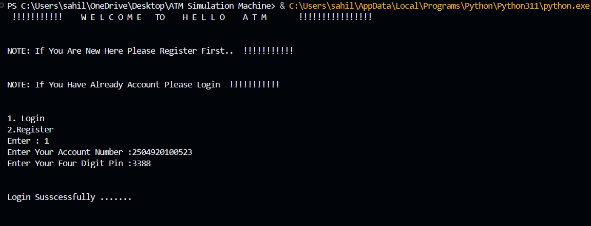
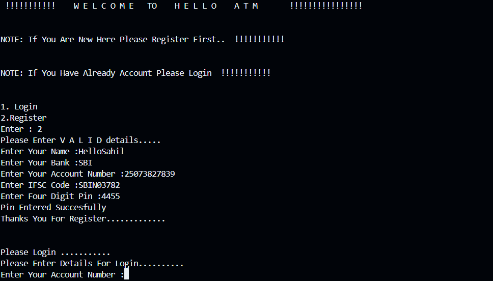
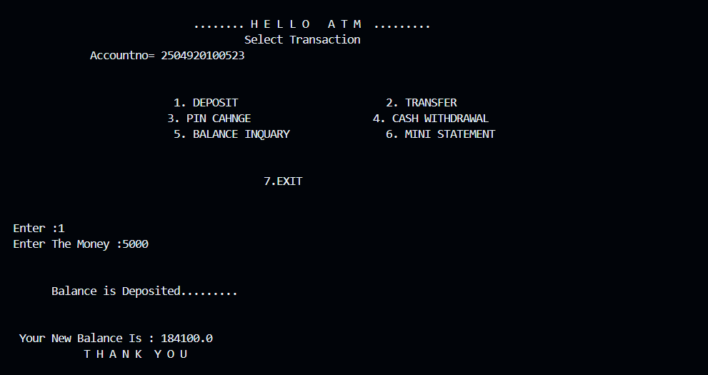
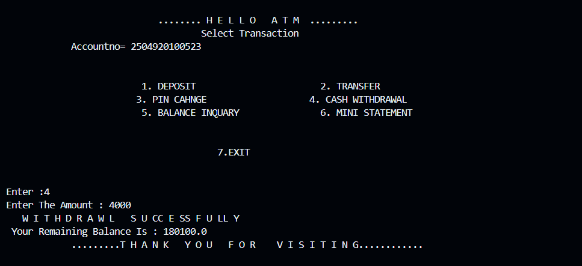
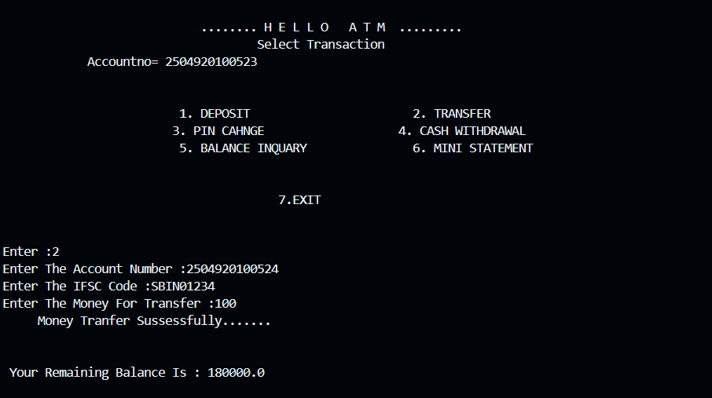
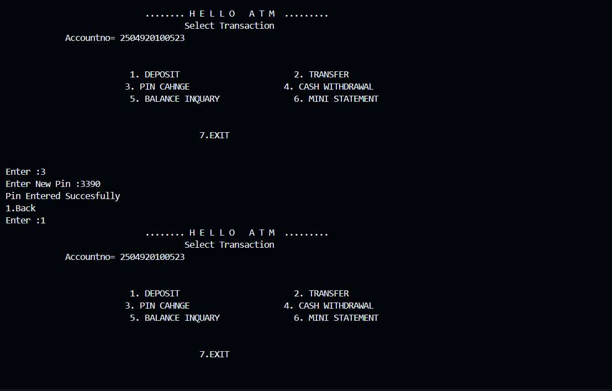
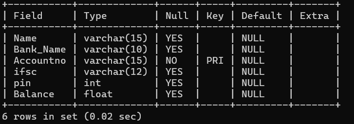
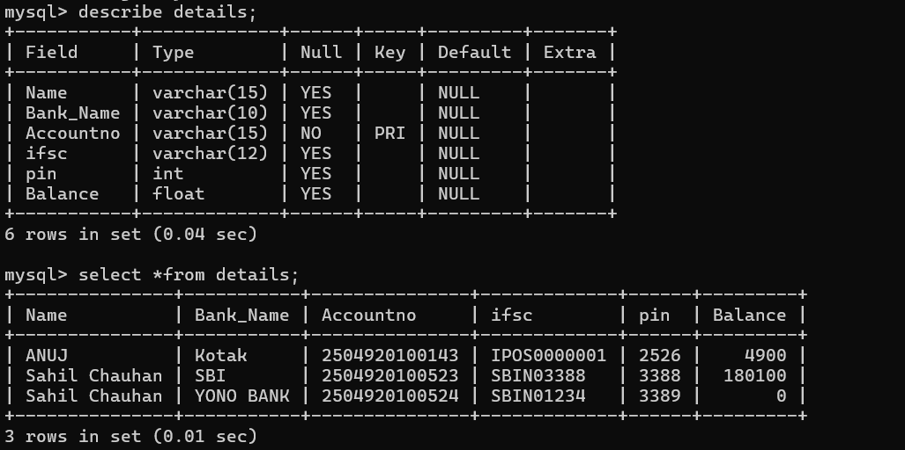
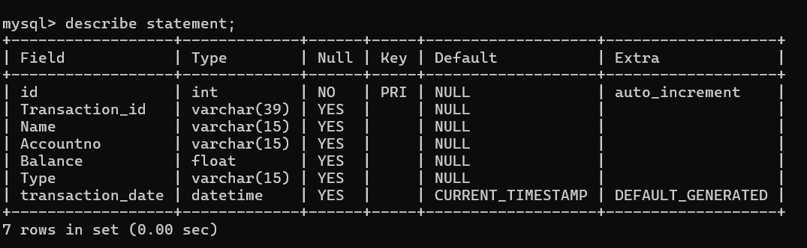
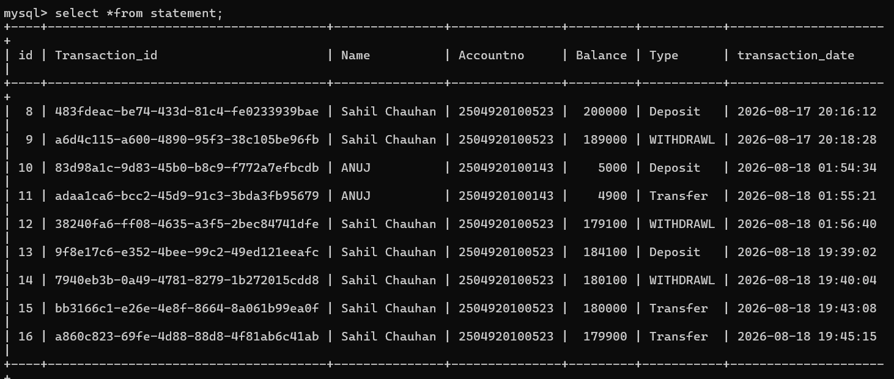

# ATM_Simulation-Machine-
A Python and MySQL-based ATM Management System that simulates real-world banking operations such as user registration, secure login, deposits, withdrawals, fund transfers, PIN management, balance inquiry, and transaction history

## 📸 Project Screenshots

### 🔐 Login

### 👤 Registration

### 💰 Deposit

### 💸 Withdrawal

### 🔄 Money Transfer

### 📜 Mini Statement

![Mini_Statement]](OutputScreenShort/Ministatement.png)

### Pin Change

### Balance Inquery

### Main Display

### sql details table

### sql details

### sql statement table

### sql statement

